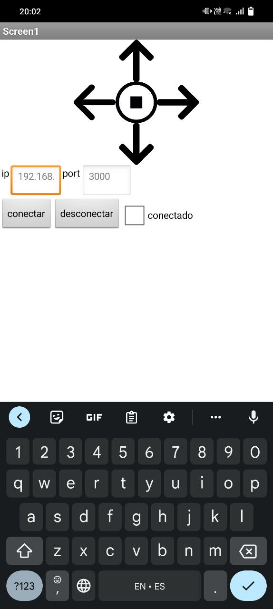
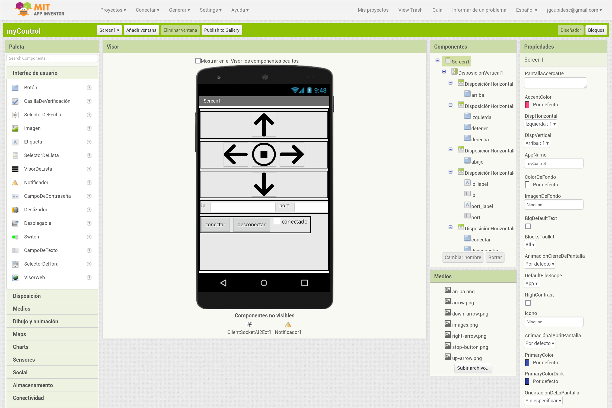
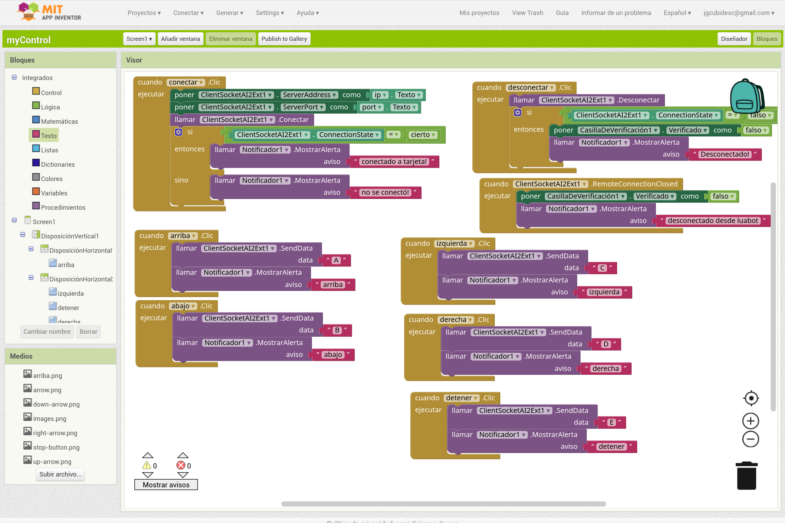
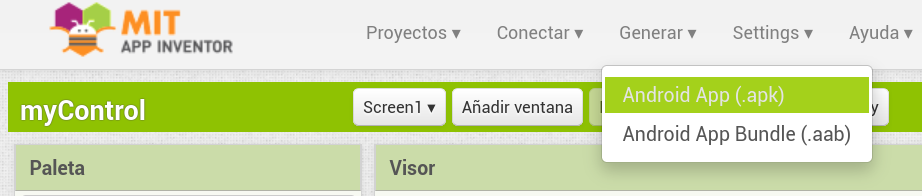
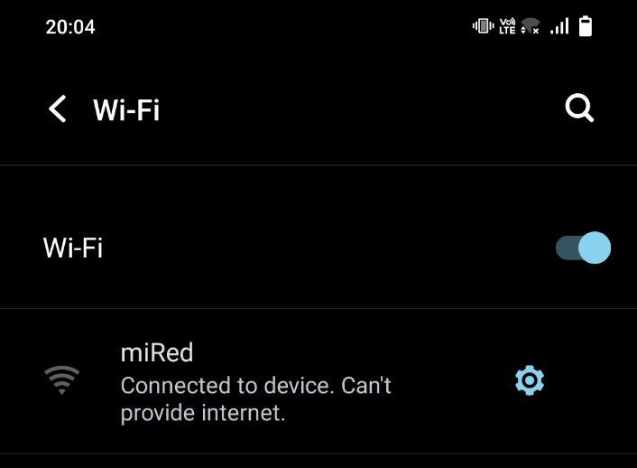
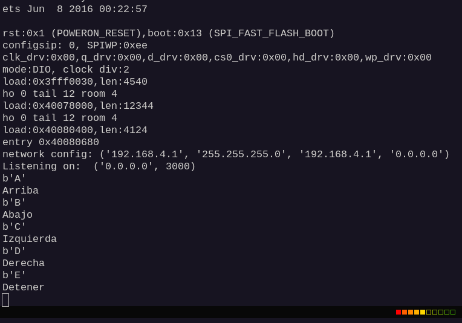

# Control digital appinventor



Se trata de una aplicación creada en [app inventor](ihttps://appinventor.mit.edu/) capaz de
enviar ordenes por socket (TCP/IP) a un dispositivo que tenga micropython, nodemcu (lua) o cualquier
otro que pueda generar un servicio socket.

Contenido del directorio `appinventor`:

```bash
├── appinventor
│   ├── myControl.apk
│   └── myControl-digital.aia
```

* Archivo `myControl.apk`: se trata de la aplicación lista para instalar y correr en un dispositivo
android. Podrá realizar la prueba y conectarse a una tarjeta de desarrollo.
* `myControl-digital.aia`: Es el archivo fuente de la aplicación el cual se puede cargar en
[app inventor](ihttps://appinventor.mit.edu/) asociando una cuenta de google, esta opción permite
editar y crear la aplicación a la medida de las necesidades.

## Sobre app inventor

Como ya se mencionó se requiere crear una cuenta en appinventor y al cargar el proyecto de extensión .aia
Podrá cargar el proyecto en el área de trabajo:

Proyecto .aia en el área de diseño:



Proyecto .aia en el área de bloques:



Podrá realizar las modificaciones pertinentes tanto en el diseño de la app como también en la lógica.
Cuando ya esté seguro podrá contruir la app y enviar el resultado al celular desde la sección de generación:



## Comunicación de la apk a un esp32 con micropython

En el directorio `esp32-micropython`:

```bash
├── esp32-micropython
│   ├── main.py
│   ├── wifiAP.py
│   └── wifiSTA.py

```

Cargue los tres archivos a un esp32 con un firmeware de micropython y ejecute el programa, seguido
deberá conectarse a la red wifi que creará el esp32:



Observe en la terminal del esp32 la ip y el puerto donde está habilitado el servicio, en la siguiente
imagen notará que el servicio se encuentra en la ip: **192.168.4.1** y el puerto: **3000**; esta
información deberá ser digitada en los campos de la apk correspondientes, para luego dar la orden en la
apk de conectar. Seguido a esto, en la misma apk podrá oprimir las diferentes flechas, notará en la
terminal de thonny como se irá imprimiendo que acciones se han recibido en el esp32 desde la apk:



Revise los archivos de extensión .py y edite según necesidades, podrá cambiar cosas como el puerto
de conexión el nombre de red, contraseña entre otras.

Regards Johnny
